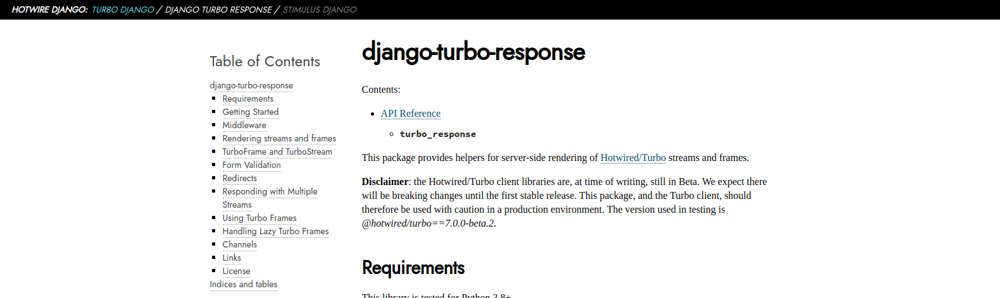

What is this ?
==============

Alabaster Hotwire is a fork of [Alabaster](http://alabaster.readthedocs.io), the default Sphinx theme,
quickly modified (hacked ?) to follow the same style as [Hotwire.dev](https://hotwire.dev).



How to use it for Django Hotwire projects ?
===========================================

Add the theme to the documentation requirements.txt (along Sphinx)

```
git+https://github.com/hotwire-django/sphinx-hotwire-theme.git
```

Change the theme in the `conf.py` file
```python
html_theme = "alabaster_hotwire"
```

Then, add this variable to populate the top bar with the following:
```python
html_context = {
    'topbar' : [
        {"url": "https://turbo-django.readthedocs.io/", "name": "Turbo Django", "active": True},
        {"url": "https://django-turbo-response.readthedocs.io/", "name": "Django Turbo Response"},
        {"name": "Stimulus Django"},
    ]
}
```

We should try to keep the same like on every documentation website we have so users won't be surprised.
Just change `active` to `True` to match the current repo.
